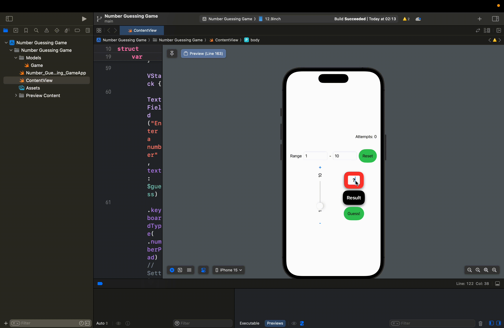
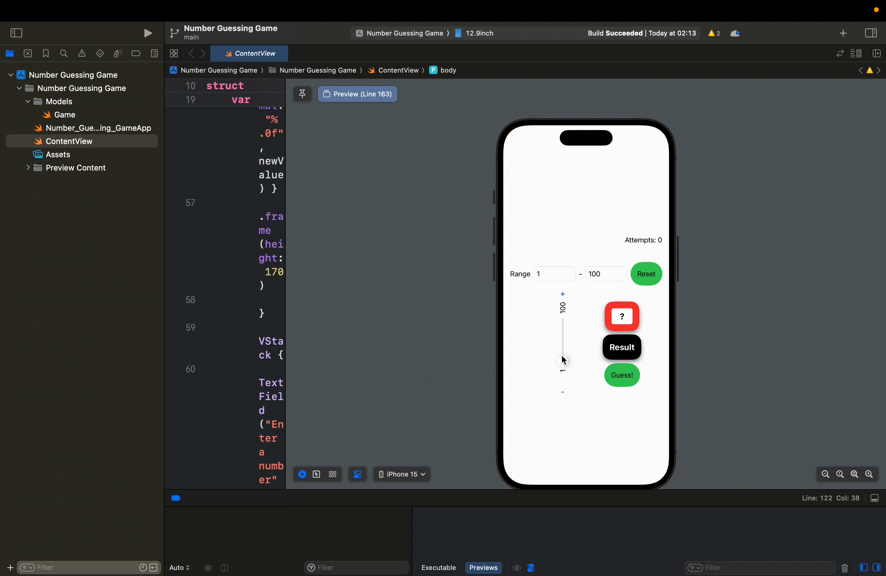
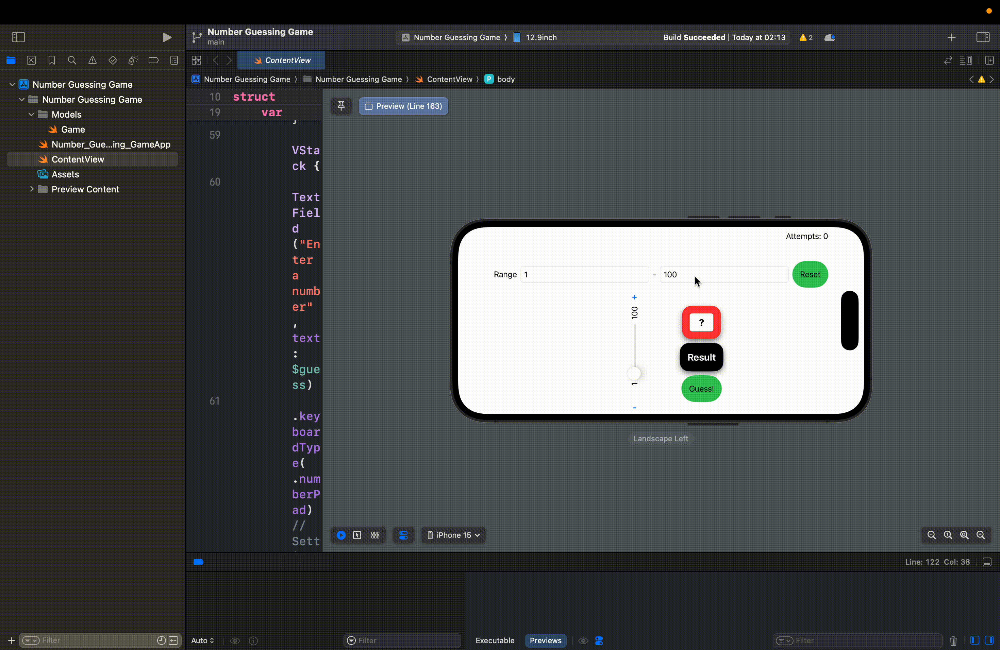

# cn436-as1

### Developer
Student ID
``` Student ID
6410615139
```
Name(English)
``` Name(English)
Supakrit Nithikethkul
```
Name(Thai)
``` Name(Thai)
ศุภกฤต นิธิเกตุกุล
```

### Function
##### Requirements
1. ผู้เล่นสามารถเลือกจำนวนเพื่อทายได้
2. ระบบมีวิธีบอกใบผู้เล่นว่าทายถูกหรือจํานวนที่ถูกสูงกว่าหรือต่ํากว่าจํานวนที่ทายได้
3. ระบบจะหยุดเมื่อทายถูกและแสดงจํานวนครั้งที่ผูัเล่นทายก่อนทายถูก
4. สามารถเล่นเกมใหม่ได้

##### Optional
- สามารถกำหนดช่วงของตัวเลขที่ต้องการได้
- ผู้เล่นสามารถเลือกจำนวนเพื่อทายได้ ด้วย 3 วิธีการ คือ
    - Slider
    - TextField
    - Button

- สามารถใช้ได้ทั้งแนวตั้งและแนวนอน

### GIF
> จํานวนครั้งที่ผูัเล่นทาย
>> 
> ผลลัพธ์เมื่อชนะ
>> 
> กำหนดช่วงของตัวเลข
>> 
> เลือกจำนวนเพื่อทายได้ ด้วย 3 วิธีการ
>> 
> แนวนอน
>> 

### Video demo
__[Video demo](https://drive.google.com/file/d/1mHEFyp6GTifvS90biK8cUcU_Sidg05Tp/view?usp=share_link)__ - google drive link

